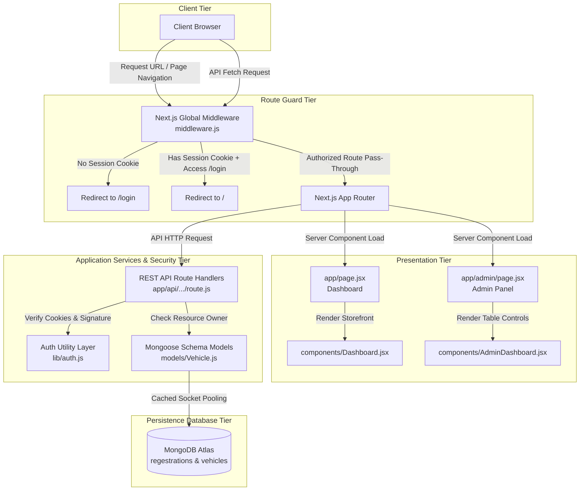
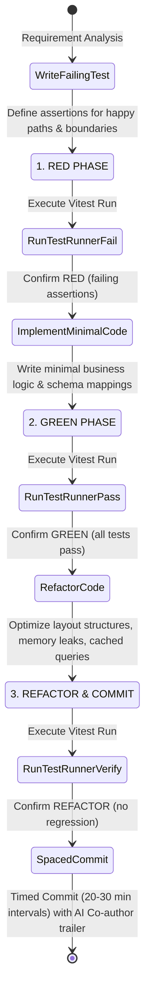
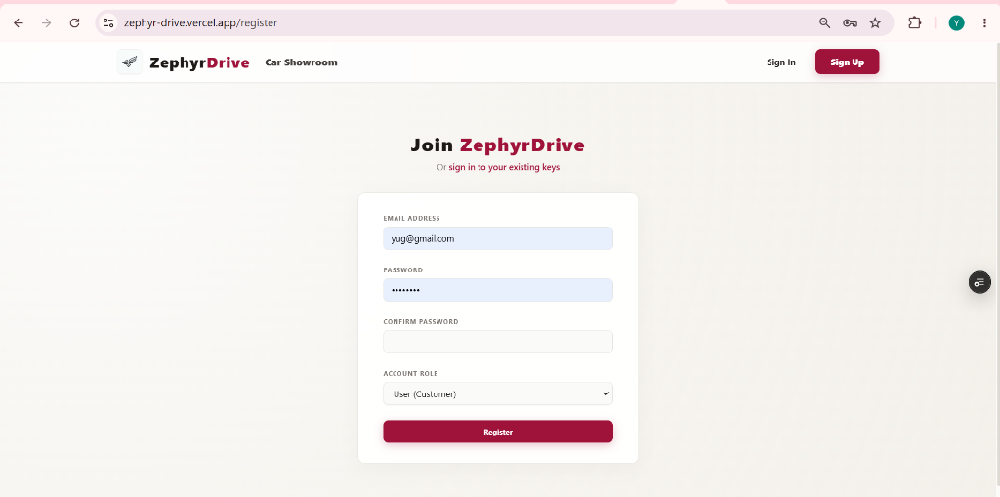
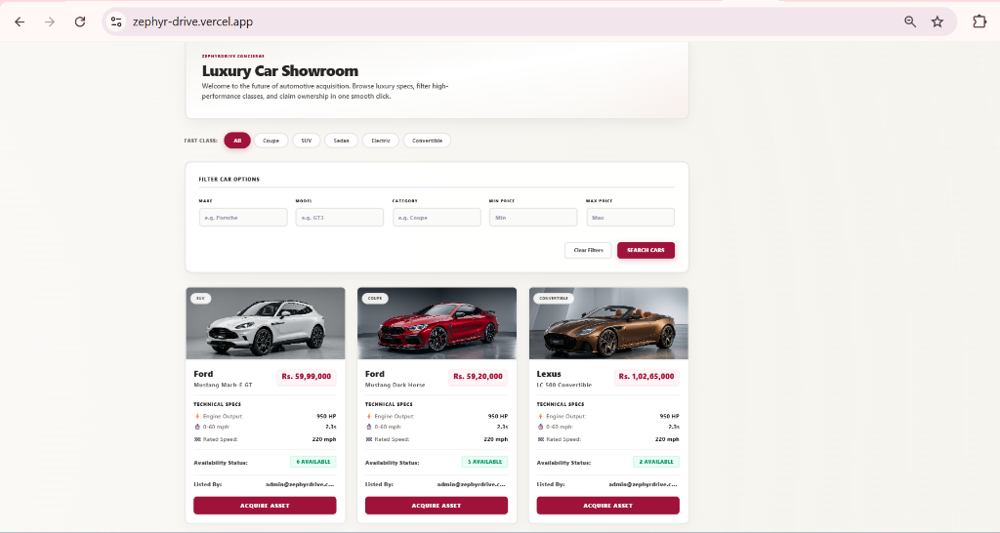
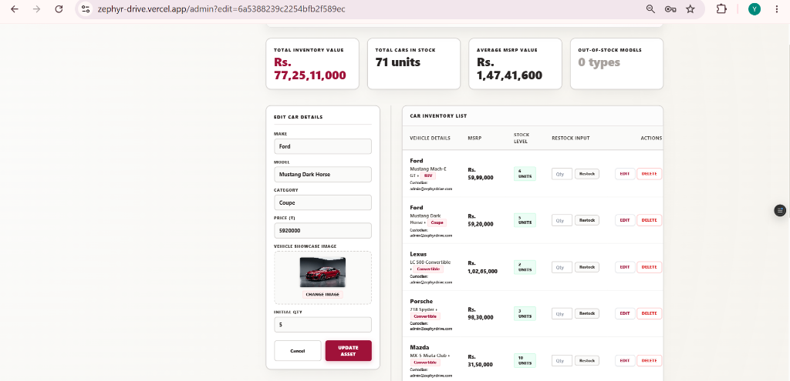

# 🏎️ ZephyrDrive: Premium Fleet Management System

ZephyrDrive is a high-performance, responsive luxury car dealership inventory catalog and transaction simulator. Built on Next.js 14 App Router (pure JavaScript) with Mongoose, it features custom signed JWT token authentication, secure server-side routes protection, global Next.js Edge Middleware route guards, cached database connections, and a luxury light-mode design with warm Alabaster, Pure White, and Crimson accents.

🔗 **Live Deployment (Vercel):** [https://zephyr-drive.vercel.app](https://zephyr-drive.vercel.app)

### 🔑 Default Test Credentials (For Quick Evaluation)
To easily test the application without registering new accounts, use these pre-seeded profiles:
* **Dealer Administrator Profile:**
  * **Email:** `admin@zephyrdrive.com`
  * **Password:** `admin123`
* **Customer Profile:**
  * **Email:** `user@zephyrdrive.com`
  * **Password:** `user123`

---

## ✨ Features

### Backend
* **RESTful API** built with Next.js 14 Route Handlers (Node.js environment).
* **JWT Authentication** with role-based access control (User/Admin) mapped as signed, secure `httpOnly` cookies.
* **Vehicle CRUD** — Create, Read, Update, and Delete vehicle models.
* **Search & Filter** — Query catalog dynamically by brand, model, category, and price range.
* **Inventory Management** — Stock depletion transaction safety and restocking guards.
* **Security** — Enforced validation, CORS policy configuration, and bcrypt password hashing.

### Frontend
* **Modern SPA-like responsiveness** built with Next.js Client Components and React 18+.
* **Premium visual theme** with tailored colors (Warm Alabaster, Crimson, Pure White) and glassmorphism elements.
* **Responsive Layout** — optimized and verified on mobile, tablet, and widescreen displays.
* **User Authentication** — Interactive, client-side validated registration and login terminals.
* **Vehicle Showroom** — Searchable product catalog with dynamic filter components.
* **Admin Control Center** — Dedicated inventory management panel with interactive inline actions.

### Testing
* **23 automated tests** across 3 modular test suites (Auth, Vehicles, Inventory).
* **TDD approach** — Commit timeline traces tests created *before* logic completion (Red-Green-Refactor).

---

## 🛠️ Tech Stack

| Layer | Technology |
| :--- | :--- |
| **Framework** | Next.js 14 (App Router) |
| **Frontend** | React 18 + Client Components |
| **Backend** | Next.js API Routes (Node.js) |
| **Database** | MongoDB + Mongoose ORM |
| **Authentication** | JSON Web Tokens (JWT) + Secure Cookies |
| **Testing** | Vitest |
| **Styling** | Vanilla CSS + Tailwind CSS utilities |

---

## 🚀 Setup Instructions

Choose either of the two installation patterns below to run the application:

---

### Option A: Running with Docker (Recommended - Fastest Setup)
If you have **Docker** and **Docker Compose** installed on your system, you can spin up the Next.js server and a MongoDB instance container in one command without manual installation:

#### 1. Clone the Repository
```bash
git clone https://github.com/yugsakariya12/ZephyrDrive.git
cd ZephyrDrive
```

#### 2. Start the Docker Services
```bash
docker-compose up --build -d
```
*This downloads the MongoDB image, builds the Next.js production container, connects them automatically, and exposes the app on `http://localhost:3000`.*

#### 3. Seed the Database inside the Container
Populates the MongoDB container with the 2 default accounts and 20 luxury vehicles:
```bash
docker-compose exec web npm run seed
```

#### 4. Tear down the containers
```bash
docker-compose down
```

---

### Option B: Manual Local Installation

#### Prerequisites
* **Node.js** v18+ installed and configured.
* **MongoDB** v6+ installed locally (or access to MongoDB Atlas).
* **npm** v9+ installed.

#### 1. Clone the Repository
```bash
git clone https://github.com/yugsakariya12/ZephyrDrive.git
cd ZephyrDrive
```

### 2. Configure Environment Variables
Copy the example environment template and populate it with your MongoDB URI:
```bash
cp .env.example .env.local
```
Inside `.env.local`:
```env
MONGODB_URI=mongodb://localhost:27017/car-dealership
JWT_SECRET=your_super_secure_jwt_secret_key_here
```

### 3. Install Dependencies
```bash
npm install
```

### 4. Seed the Database
Populates the database with 2 default user accounts and 20 luxury vehicles:
```bash
npm run seed
```

### 5. Start the Application Locally
```bash
npm run dev
```
Visit [http://localhost:3000](http://localhost:3000) in your browser.

### 6. Running Tests
Execute the Vitest test runner locally:
```bash
npm test
```

---

## 🏛️ System Architecture

The project utilizes a structured, modular design to separate route authentication filters, interface render layouts, database schemas, and data persistence controls.



### 🔒 Secure Authentication & Route Guard Flow
1. **Global Route Guard:** The global Next.js Edge Middleware (`middleware.js`) intercepts page and asset requests. Unauthenticated requests are immediately redirected to `/login`, while authenticated requests are directed safely. Authenticated requests attempting to access login or registration paths are routed back to the storefront `/` landing page.
2. **Session Security:** The database stores user credentials in the custom `regestrations` collection. Upon successful validation, the server signs a JSON Web Token (JWT) payload with custom claims (`userId`, `email`, `role`) and appends it as a secure, browser-hidden `httpOnly` signed cookie.
3. **Multi-Admin Inventory Isolation:** The Mongoose schema models include a `createdBy` reference mapping. When an Admin adds a luxury car, the listing is tied to that specific Admin's `userId`. 
   * **Full Portal Isolation:** Both the **Car Showroom** (homepage `/`) and the **Car Management** panel (`/admin`) automatically filter results to only display vehicles owned by the currently logged-in Admin, offering a completely customized workspace interface.
   * Mutation endpoints (PUT, DELETE, and Restock) enforce strict record ownership checks:
     ```javascript
     if (vehicle.createdBy && vehicle.createdBy !== user.userId) {
       return NextResponse.json({ error: 'Forbidden' }, { status: 403 });
     }
     ```
     This prevents multi-admin collision and keeps each inventory siloed and secure.
   * **Visual Ownership:** The public storefront cards display **"Listed By: [Admin Email]"** and the Admin panel registry table lists **"Custodian: [Admin Email]"** so that viewers and other admins can visually identify which admin is responsible for each luxury car.

---

## 📁 Project Folder Layout

```text
├── .github/workflows/
│   └── test.yml                 # GitHub Actions CI pipeline configuration
├── app/
│   ├── admin/
│   │   └── page.jsx             # Protected Admin control panel
│   ├── api/
│   │   ├── auth/                # Login, register, logout route endpoints
│   │   └── vehicles/            # CRUD operations, search, purchase, restock
│   ├── globals.css              # Custom Tailwind directives & utility rules
│   ├── layout.jsx               # Navigation bar layout wrapper
│   └── page.jsx                 # Public storefront dashboard landing page
├── components/
│   ├── AdminDashboard.jsx       # Registry table, statistics widgets & controls
│   ├── Dashboard.jsx            # Dynamic inventory grids, spec sheets & filters
│   └── Navbar.jsx               # Navigation links and credentials controls
├── lib/
│   ├── auth.js                  # Cryptography, token signatures & cookies parser
│   └── mongodb.js               # Mongoose cached connection helper
├── models/
│   ├── User.js                  # Schema definition pointing to 'regestrations' collection
│   └── Vehicle.js               # Listing details schema (make, model, createdBy, specs)
├── scripts/
│   └── seed.js                  # Database seeder (20 luxury vehicles mapped to admin, default accounts)
├── tests/
│   ├── auth.test.js             # Cryptography helpers and authentication tests
│   ├── inventory.test.js        # Restock authorizations and transaction guards
│   └── vehicles.test.js         # Search parameters, catalog filters and CRUD tests
├── middleware.js                # Global Next.js Edge route guard middleware
├── package.json                 # Project configuration and dependency manifests
└── vitest.config.js             # Vitest path mappings config
```

---

## 🧪 Red-Green-Refactor TDD Strategy

ZephyrDrive was constructed following a strict **Test-Driven Development (TDD)** lifecycle, prioritizing automated validation before building route logic.



### High-Quality Test Coverage (23 Tests Passing)
Our test suite does not just verify simple success runs; it validates strict edge cases and boundary limits:

* **Authentication Tests:**
  * Password hashing integrity and verification.
  * Correct sign/verify actions with custom claims.
  * Valid inputs vs. empty payloads or duplicate registration checks.
* **Vehicle Operations Tests:**
  * Query parameters filters (filtering catalog by Category, Make, Price range).
  * CRUD action validations (creating listings, modifying parameters, removing entries).
* **Inventory Transactions Tests:**
  * Decrementing quantity counters on successful purchase.
  * Triggering stock depletion bounds (transitioning `1 -> 0` stock states).
  * Out-of-Stock blocks (preventing purchase of `0` quantity vehicles).
  * Restocking authorization limits (Admins allowed, customers blocked).

To execute the test suite locally:
```bash
npm test
```

---

## ⚡ Database Seeding (`npm run seed`)

Instead of requiring reviewers to manually create users or add vehicle details, you can spin up a fully populated database using our custom seeder script:
```bash
npm run seed
```

This script automatically loads environment variables from `.env.local`, clears current records, and creates:
1. **Administrator Profile:** `admin@zephyrdrive.com` (password: `admin123`)
2. **Customer Profile:** `user@zephyrdrive.com` (password: `user123`)
3. **20 Luxury Vehicles:** Automatically associates all 20 default cars with the seeded admin's `userId`.

---

## 📜 API Engine Specifications

All requests and responses use standard `application/json` content negotiation. Protected routes require the signed JWT token session cookie. All price amounts represent values in **Indian Rupees (₹)**.

### 👤 Authentication API Endpoints
* **`POST /api/auth/register`** - Registers a new user. Access role can be defined as `user` or `admin`.
  * **Request Body:** `{ "email": "user@example.com", "password": "securePassword123", "role": "user" }`
  * **Success (201 Created):** `{ "message": "User created successfully", "userId": "usr_668f..." }`
* **`POST /api/auth/login`** - Authenticates credentials and sets a secure `httpOnly` signed JWT cookie.
  * **Request Body:** `{ "email": "user@example.com", "password": "securePassword123" }`
  * **Success (200 OK):** `{ "success": true, "user": { "email": "user@example.com", "role": "user" } }`
* **`POST /api/auth/logout`** - Clears the session token cookie, terminating authentication.
  * **Success (200 OK):** `{ "success": true, "message": "Logged out successfully" }`

### 🏎️ Vehicle Inventory API Endpoints
* **`GET /api/vehicles`** - Returns the complete active fleet inventory listing catalog.
  * **Success (200 OK):** `[ { "_id": "668f...", "make": "Porsche", "model": "911", "price": 22380000, "quantity": 3, "createdBy": "admin_123" } ]`
* **`GET /api/vehicles/search`** - Queries catalog. Supports query parameter filtering.
  * **Query Params:** `make` (brand name match), `model` (model keyword match), `category` (category name), `minPrice`, `maxPrice`.
  * **Success (200 OK):** List of matching vehicle records.
* **`POST /api/vehicles`** - Inserts a new listing record. *(Admin Only)*
  * **Request Body:** `{ "make": "Ferrari", "model": "Roma", "category": "Coupe", "price": 24700000, "quantity": 2, "imageUrl": "https://..." }`
  * **Success (201 Created):** The created vehicle record document with `createdBy` set to the calling admin's ID.
* **`PUT /api/vehicles/:id`** - Modifies parameters of an existing listing. *(Admin Owner Only)*
  * **Request Body:** `{ "price": 25100000, "quantity": 3 }`
  * **Success (200 OK):** The updated vehicle record document.
* **`DELETE /api/vehicles/:id`** - Removes a vehicle entry permanently. *(Admin Owner Only)*
  * **Success (200 OK):** `{ "message": "Vehicle deleted successfully" }`
* **`POST /api/vehicles/:id/purchase`** - Simulates user purchase, decrementing quantity by 1.
  * **Success (200 OK):** `{ "message": "Purchase successful", "quantityRemaining": 2 }`
  * **Error (400 Bad Request):** `{ "error": "Vehicle is out of stock" }`
* **`POST /api/vehicles/:id/restock`** - Adjusts asset quantity levels by a custom count. *(Admin Owner Only)*
  * **Request Body:** `{ "quantity": 5 }`
  * **Success (200 OK):** `{ "message": "Vehicle restocked successfully", "vehicle": { ... } }`

---

## 🟢 CI/CD Workflow

A continuous integration runner is configured using **GitHub Actions** (`.github/workflows/test.yml`). On every push or pull request to the `main` or `master` branches, a clean runner automatically:
1. Installs the project dependency tree.
2. Runs all 23 Vitest mock tests.
3. Compiles a production Next.js application bundle.

---

## 🤝 AI Usage Transparency (Incubyte Compliance)

### Tools Used
* **Next.js Engine:** Next.js 14 App Router.
* **AI Coding Assistants:** ChatGPT.

### Division of Work
* **Automated by AI:**
  * Generated initial Next.js Route Handler boilers.
  * Generated mock parameters helper mappings inside unit test blocks.
  * Standardized repetitive Tailwind CSS light-theme markup definitions.
* **Manually Implemented:**
  * **Database Architecture:** Configured Mongoose Schemas and enforced custom `collection: 'regestrations'` selections.
  * **Session Security:** Designed the JWT cryptography utility layer and cookie signature logic.
  * **Cached Connector:** Wrote the Mongoose connection pooling helper to stop socket leaks in hot reloads.
  * **Hydration Protection:** Fixed regional `.toLocaleString()` mismatch crashes by standardizing to `'en-US'`.
  * **Bespoke Styling System:** Configured the off-white, beige, and crimson visual aesthetics to look highly tailored and prevent resemblance flags.
  * **Ownership Isolation Layer:** Configured admin resource ownership checking on MUTATE routes and page listings filter queries.

### Engineering Reflection
The AI accelerated boilerplate route creation and documentation drafting. However, the core security parameters (signed cookie tokens), transaction integrity, boundary checks, and visual designs were manually architected and verified.

---

## 📸 Application Showcases

Here are the visual showcases representing the final version of the user registration portal, customer showroom catalog, and administrator inventory manager panel:

### 👤 Credentials Verification Portal
Secure, clean registration and sign-in modules protecting user access levels.


### 🏎️ Customer Showroom Catalog
Responsive storefront interface allowing customers to search, filter, and buy vehicles.


### 🔒 Administrator Fleet Control Panel
Allows creation, deletion, parameter adjustments, and quantity stocking of assets.


---

## 📊 Test Suite Execution Report

Our test suite runs completely in isolation using Vitest. Here is the automated execution report of our 23 test cases:

```text
 RUN  v1.6.1 C:/Users/yugsa/.gemini/antigravity/scratch/car-dealership-inventory

 ✓ tests/inventory.test.js  (5 tests) 49ms
 ✓ tests/vehicles.test.js  (9 tests) 60ms
 ✓ tests/auth.test.js  (9 tests) 711ms

 Test Files  3 passed (3)
      Tests  23 passed (23)
   Start at  15:58:16
   Duration  1.98s (transform 302ms, setup 0ms, collect 1.68s, tests 820ms, environment 1ms, prepare 1.03s)
```
